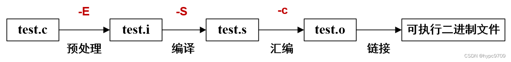

# CMake 入门教程

!!! success "请仔细阅读本文后再进行实操"

本文参考

- https://zhuanlan.zhihu.com/p/618037867

## 如何手动编译一个 C++ 程序

编写完成一个C/C++程序后，想要运行起来，必须要经过四个步骤：预处理、编译、汇编和链接。每个步骤都会生成对应的文件，如下图所示（注意后缀名）：



??? note "GCC, G++, GDB"

    - GCC：GNU Compiler Collection（GNU编译器集合）的缩写，可以理解为一组GNU操作系统中的编译器集合，可以用于编译C、C++、Java、Go、Fortan、Pascal、Objective-C等语言。
    - gcc：GCC（编译器集合）中的GNU C Compiler(C 编译器)
    - g++：GCC（编译器集合）中的GNU C++ Compiler(C++ 编译器)
    - gdb：全称“GNU symbolic debugger”，是 Linux 下常用的C/C++程序调试器。


### 编译与链接

#### 过程

- 预处理。预处理器在程序源文件被编译之前根据预处理指令对程序源文件进行处理，C/C++ 主要的预处理功能有文件包含、宏替换、条件编译等。

- 编译。编译阶段是检查语法，生成汇编。第一遍执行语法分析和静态类型检查，将源代码解析为语法分析树的结构。第二遍由代码生成器遍历语法分析树，把树的每个节点转换为汇编语言或机器代码，生成目标模块（`.o` 或 `.obj` 文件）

- 汇编。汇编代码转换机器码。非底层的程序员不需要考虑这一阶段，编译器也不会出错。汇编与 C/C++开发者无关，但是我们可以利用反汇编来调试代码，学习汇编语言依然是必备的。

- 链接。把一组目标模块链接为可执行程序，使得操作系统可以执行它。处理目标模块中的函数或变量引用，必要时搜索库文件处理所有的引用。

#### 编译指令

这里我们使用 `g++` 编译器讲解编译指令。

- `g++ -c` 表示只编译不链接
- `g++ -o ex1.out ex1.o` 表示将 `ex1.o` 链接为可执行文件 `ex1.out`
- `g++ main.cpp func.cpp -o main.out` 直接编译生成可执行文件（`g++` 帮我们省略了一些步骤）

#### 链接

将各个目标文件中的各段代码进行地址定位，生成与特定平台相关的可执行文件。外部函数的声明（一般声明在头文件中）只是令程序顺利通过编译，此时并不需要搜索到外部函数的实现（或定义）。在链接过程中，外部函数的实现（或定义）才会被寻找和添加进程序，一旦没有找到函数实现，就无法成功链接。


### 一个案例

本节内容用下面的简单C++工程做演示。示例的文件结构如下：

```bash
|-- include
    |-- func.h
|-- src
    |-- func.cpp
|-- main.cpp
```
其中，`main.cpp`是主要代码，`include/func.h`是自定义函数的头文件，`src/func.cpp`是函数的具体实现

``` cpp title="main.cpp"
#include <iostream>
#include "func.h"

using namespace std;

int main() 
{
    int a = 1;
    int b = 2;
    cout << "a + b = " << sum(a, b) << endl;; 

    return 0;
}
```

``` cpp title="func.h"
#ifndef FUNC_H
#define FUNC_H

int sum(int a, int b);

#endif
```

``` cpp title="func.cpp"
#include "func.h"

int sum(int a, int b) {
    return a + b;
}
```

#### 步骤 1 - 预处理

预处理，顾名思义就是编译前的一些准备工作。

预编译把一些`#define`的宏定义完成文本替换，然后将`#include`的文件里的内容复制到`.cpp`文件里，如果`.h`文件里还有`.h`文件，就递归展开。在预处理这一步，代码注释直接被忽略，不会进入到后续的处理中，所以注释在程序中不会执行。

gcc/g++的预处理实质上是通过预处理器cpp（应该是c preprocess的缩写?）来完成的，所以我们可以通过`g++ -E`对`main.cpp`进行预处理：

``` bash
g++ -E -I include/ main.cpp -o main.i
```

上述命令中：

- `g++ -E` 是让编译器在预处理之后就退出，不进行后续编译过程。 
- `-I include/`用于指定头文件目录。
- `main.cpp`是要预处理的源文件。
- `-o main.i`用于指定生成的文件名。

预处理之后的程序格式为 *.i，仍是文本文件，可以用任意文本编辑器打开。

执行完预处理后的文件结构如下：

```bash
|—— include
      |—— func.h
|—— src
      |—— func.cpp
|—— main.cpp
|—— main.i
```

#### 步骤 2 - 编译

??? tip "什么是编译"
        编译只是把我们写的代码转为汇编代码，它的工作是检查词法和语法规则，
        所以，如果程序没有词法或则语法错误，那么不管逻辑是怎样错误的，都不会报错。        

        编译不是指程序从源文件到二进制程序的全部过程，
        而是指将经过预处理之后的程序转换成特定汇编代码(assembly code)的过程。

编译的指令如下：

``` bash
g++ -S -I include/ main.cpp -o main.s
```

与预处理类似，上述命令中：

- `g++ -S`是让编译器在编译之后停止，不进行后续过程；
- `-I include/`用于指定头文件目录；
- `main.cpp`是要编译的源文件；
- `-o main.s`用于指定生成的文件名。

编译完成后，会生成程序的汇编代码`main.s`，这也是文本文件，可以直接用任意文本编辑器查看。

执行完编译后的文件结构如下：

```bash
|—— include
      |—— func.h
|—— src
      |—— func.cpp
|—— main.cpp
|—— main.i
|—— main.s
```

#### 步骤 3 - 汇编

> 汇编过程将上一步的汇编代码(`main.s`)转换成机器码(machine code)，这一步产生的文件叫做目标文件(`main.o`)，是二进制格式。

`gcc/g++`的汇编过程通过 `as` 命令完成，所以我们可以通过`g++ -c`或`as`命令完成汇编：

``` bash
g++ -c -I include/ main.cpp -o main.o
# 或者直接调用 as 命令
as main.s -o main.o
```

上述指令中： 

- `g++ -c`让编译器在汇编之后退出，等价于 `as`； 
- `-I include/`仍是用于指定头文件目录； 
- `main.cpp`是要汇编的源文件；
- `-o main.o`用于指定生成的文件名。

汇编这一步需要为每一个源文件（本文示例代码中为`main.cpp`、`func.cpp`）产生一个目标文件。因此`func.cpp`也需要执行一次这个汇编过程产生一个`func.o`文件:

``` bash
# 可以用 g++ -c 命令一步生成 func.o
g++ -c -I include/ src/func.cpp -o src/func.o
# 当然也可以按照上面的预处理、编译、汇编三个步骤生成func.o
```

到了这一步，代码的文件结构如下：

```bash
|—— include
      |—— func.h
|—— src
      |—— func.cpp
      |—— func.o
|—— main.cpp
|—— main.i
|—— main.s
|—— main.o
```

#### 步骤 4 - 链接

C/C++代码经过汇编之后生成的目标文件(*.o)并不是最终的可执行二进制文件，而仍是一种中间文件(或称临时文件)，目标文件仍然需要经过链接(Link)才能变成可执行文件。


??? tip "链接"
        既然目标文件和可执行文件的格式是一样的（都是二进制格式），为什么还要再链接一次呢？

        因为编译只是将我们自己写的代码变成了二进制形式，
        它还需要和系统组件（比如标准库、动态链接库等）结合起来，
        这些组件都是程序运行所必须的。

        链接（Link）其实就是一个“打包”的过程，
        它将所有二进制形式的目标文件(.o)和系统组件组合成一个可执行文件。
        完成链接的过程也需要一个特殊的软件，叫做链接器（Linker）。

        此外需要注意的是：C++程序编译的时候其实只识别.cpp文件，
        每个cpp文件都会分别编译一次，生成一个.o文件。
        这个时候，链接器除了将目标文件和系统组件组合起来，
        还需要将编译器生成的多个.o或者.obj文件组合起来，
        生成最终的可执行文件(Executable file)。

以本文中的代码为例，将`func.o`和`main.o`链接成可执行文件`main.out`，指令如下:

``` bash
g++ src/func.o main.o -o main.out
```

- `-o main.out`用于指定生成的可执行二进制文件名
- 由于g++自动链接了系统组件，所以我们只需要把自定义函数的目标文件与`main.o`链接即可。

运行`main.out`，结果如下：

``` bash
./main.out
a + b = 3
```

从上面的介绍可以看出，从C++源代码到最终的可执行文件的中间过程并不简单。了解预处理、编译、汇编、链接各个步骤的作用有助于我们处理更加复杂的项目工程。而我们接下来要学习的CMake就是为了简化这一过程，同时方便组织管理大型C++项目。

## 如何用CMake组织和管理 C++ 项目