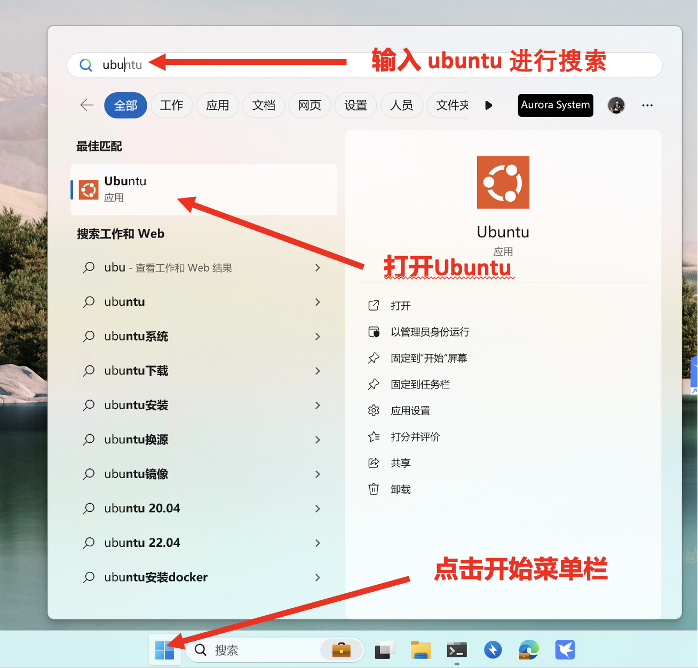
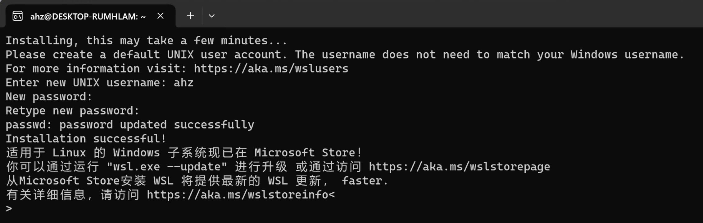
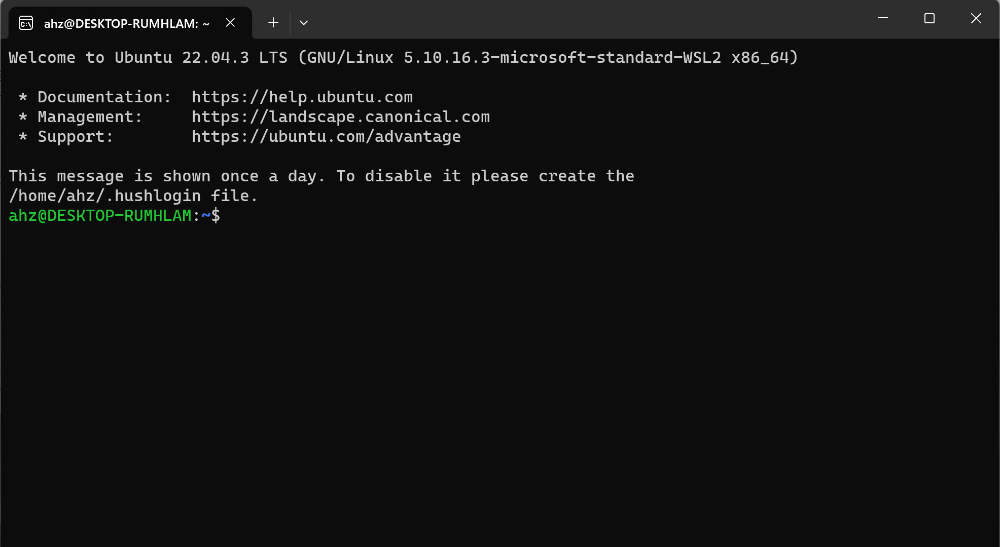
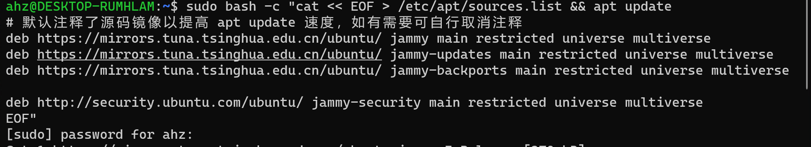
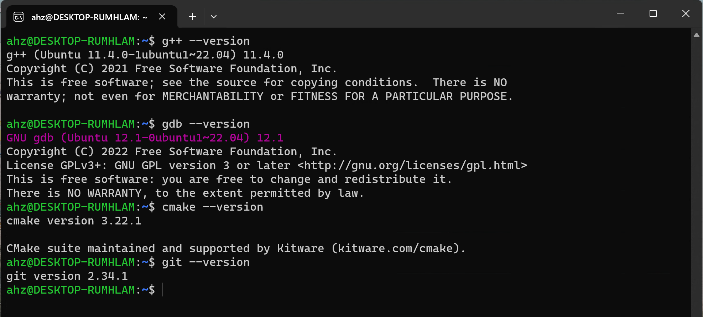

# WSL 安装 Ubuntu 并搭建 C++ 开发环境

!!! success "请仔细阅读本文后再进行实操"

## 什么是 WSL

WSL(Windows Subsystem for Linux)：Windows 系统中的一个子系统，在这个子系统上可以运行 Linux 操作系统。

可以让开发人员直接在 Windows 上按原样运行 GNU/Linux 环境（包括大多数命令行工具、实用工具和应用程序），且不会产生传统虚拟机或双启动设置开销。

## **先决条件**

必须运行 Windows 11 才能使用以下命令，如果使用的是更早的版本，请更新至 Windows 11版本。

## Windows 11 开启 WSL

### 步骤 1 - 启用适用于 Linux 的 Windows 子系统

以管理员身份打开 PowerShell（“开始”菜单 >“PowerShell” >单击右键 >“以管理员身份运行”），然后输入以下命令：

```sh
dism.exe /online /enable-feature /featurename:Microsoft-Windows-Subsystem-Linux /all /norestart
```

### 步骤 2 - 启用虚拟机功能

以管理员身份打开 PowerShell 并运行：

```sh
dism.exe /online /enable-feature /featurename:VirtualMachinePlatform /all /norestart
```

**重新启动计算机**（*一定要重启计算机*）

### 步骤 3 - 将 WSL 2 设置为默认版本

以管理员身份打开 PowerShell 并运行：

```sh
wsl --set-default-version 2
```

### 步骤 4 - 安装 Ubuntu

以管理员身份打开 PowerShell 并运行：

```sh
wsl --install -d Ubuntu
```

等待一段时间以后便安装好 Ubuntu。

### 步骤 5 - 初始化 Ubuntu

点击开始菜单栏，在搜索框中输入 `ubuntu` 进行搜索，如果没有搜索到则说明安装未完成，请重复步骤4。
搜索到则打开 Ubuntu应用。



首次启动新安装的 Linux 分发版时，将打开一个控制台窗口，系统会要求你等待一分钟或两分钟，以便文件解压缩并存储到电脑上。 未来的所有启动时间应不到一秒。


等待一段时间后 Ubuntu 初始化完成。


### 步骤 6 - 设置 Linux 用户名和密码

系统将要求你为 Linux 发行版创建“用户名”和“密码”，输入用户名或者密码结束时请按回车键。

!!! note "用户和密码设置注意事项"

    - 此用户名和密码特定于安装的每个单独的 Linux 分发版，与 Windows 用户名无关。

    - 请注意，输入密码时，屏幕上不会显示任何内容。 这称为盲人键入。 你不会看到你正在键入的内容，这是完全正常的。

    - 创建用户名和密码后，该帐户将是分发版的默认用户，并将在启动时自动登录。

    - 此帐户将被视为 Linux 管理员，能够运行 sudo (Super User Do) 管理命令。

    - 在 WSL 上运行的每个 Linux 发行版都有其自己的 Linux 用户帐户和密码。 每当添加分发版、重新安装或重置时，都必须配置一个 Linux 用户帐户。

设置好后的 Ubuntu 如下所示：



### 步骤 7 - 进入 Ubuntu 系统

按照以下步骤重新打开 Ubuntu 以后便可以得到一个 Ubuntu 的命令行。





## 什么是 Shell？

上面所说的命令行，实际上指的就是 shell。shell 是 Linux 中的一类程序，它可以接受通过键盘输入的命令，然后把命令交给系统执行，并将命令的输出返回给用户。现在几乎所有的 Linux 发行版都提供了一个叫 Bash 的 shell 程序，是传统 shell 的“增强版”。


??? note "一些关于shell的细节知识"

    但凡使用 Linux，必然要与之交互。广义上讲，能与用户交互的程序都符合 shell 的定义（比如图形界面可以识别鼠标位置信息，点击操作和键盘快捷键）。然而 Linux 本身以命令行工具为主，而 shell 狭义上就是命令行解释工具，即允许用户在一定程度上用 shell 的语言来调用程序。

    Shell 是非常重要的程序。如果发行版中没有 shell，用户便无法控制计算机了。


!!! tip "为什么要使用shell"

    - 节省资源
    
    图形界面对资源的消耗是不可忽略的，在绝大部分的服务器中都没有使用图形界面，节约资源。

    - 进行高级的系统维护工作
    
    一些高级的系统维护任务只能通过命令行来完成，因为相关的程序并没有提供图形界面的控制面板，或者需要手工编写复杂的配置文件。

    - 使用命令行看上去很酷
    
    影视作品中，操作命令行的总是技术高超的黑客。现在轮到你来操作命令行了，难道不是很酷的一件事情吗？

## Ubuntu 安装 C++ 开发环境。

### 配置 Ubuntu 镜像源

由于Ubuntu的官方软件镜像在国外，中国大陆访问较慢，因此我们需要更换中国大陆的软件镜像源加速软件安装。
接下来请在 Ubuntu 的命令行中输入下列命令。

```bash
sudo bash -c "cat << EOF > /etc/apt/sources.list && apt update 
# 默认注释了源码镜像以提高 apt update 速度，如有需要可自行取消注释
deb https://mirrors.tuna.tsinghua.edu.cn/ubuntu/ jammy main restricted universe multiverse
deb https://mirrors.tuna.tsinghua.edu.cn/ubuntu/ jammy-updates main restricted universe multiverse
deb https://mirrors.tuna.tsinghua.edu.cn/ubuntu/ jammy-backports main restricted universe multiverse
deb http://security.ubuntu.com/ubuntu/ jammy-security main restricted universe multiverse
EOF"
```

输入命令行后，你可能会遇到如下情况。



输入你之前设置的用户密码，即可执行之前输入的命令行。

??? tip "什么是镜像源？"

    - 源
    
    源就是来源，就是你安装软件时，程序从哪里获取软件包（安装程序在你的机器上，但需要安装的东西在软件源服务器上）。
    
    - 镜像
    
    镜像，原意是光学里指的物体在镜面所成之像。引用到电脑网络上，一个网站的镜像是指对一个网站内容的拷贝。镜像通常用于为相同信息内容提供不同的源，特别是在下载量大的时候提供了一种可靠的网络连接。
    
    - 镜像源
    
    镜像源就是把官方的源作为一个镜像，你可以在这下载软件。比如ubuntu官方源在国外，下载软件可能会很慢，这时候就需要换成国内的镜像源。

### 安装 C++ 开发环境

请在命令行中输入如下命令：

```bash
sudo apt install -y build-essential gdb cmake git
```
你还会遇到让你用户密码的情况，此时请输入之前配置的用户密码，即可执行之前输入的命令行。

### 验证开发环境是否搭建成功

请在命令行中一次输入如下命令：

```bash
g++ --version
```

```bash
gdb --version
```

```bash
cmake --version
```

```bash
git --version
```

如果搭建成功，便可看到如下信息：




!!! tip "Linux 如何使用"

    关于 Linux 如何使用，请阅读 [Linux基础](../linux/index.md)这一张的内容。
    该章内容只涵盖最基本的Linux使用知识，只是满足本C++课程所需的基本存活内容。
    如果想继续深入学习请自行阅读[中科大Linux 101](https://101.lug.ustc.edu.cn/)和[鸟哥的Linux私房菜](https://linux.vbird.org/linux_basic/centos7/)