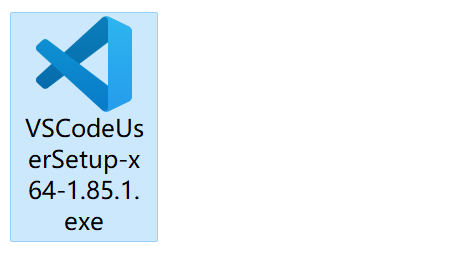
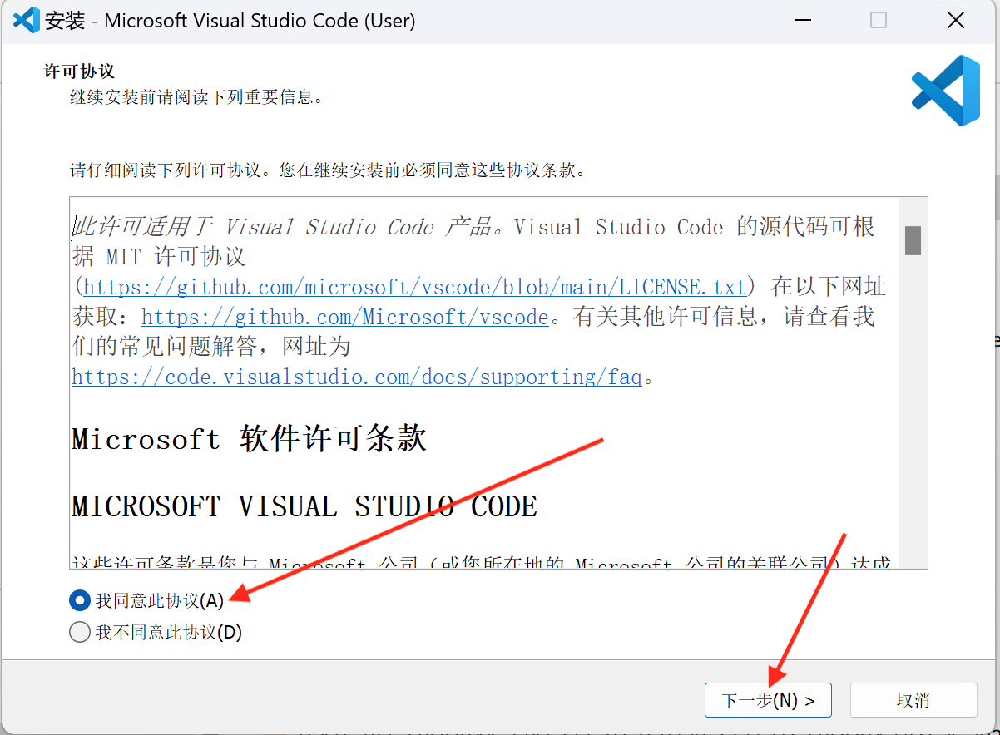
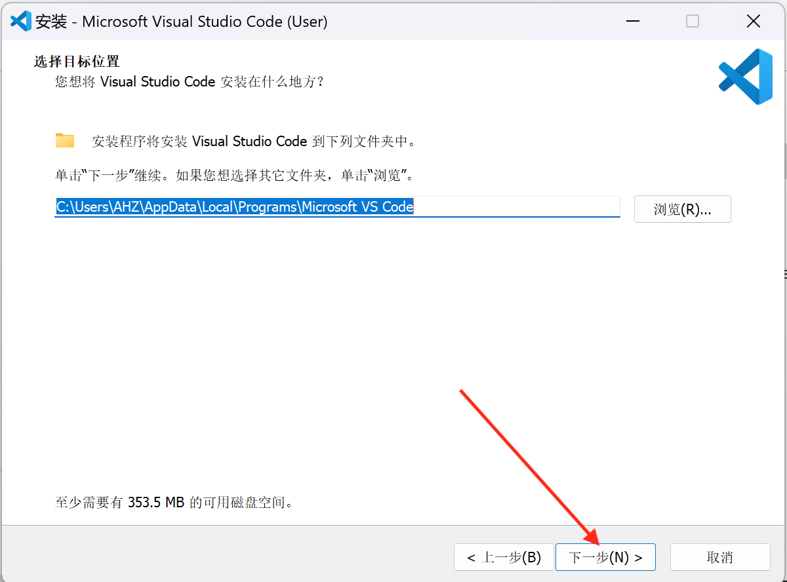
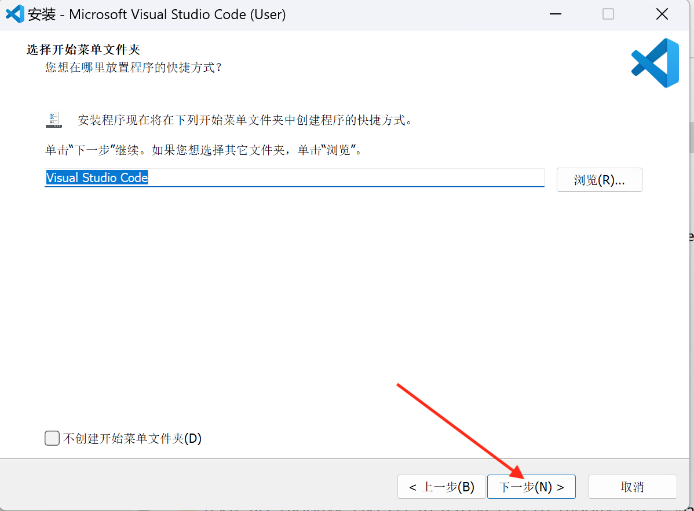
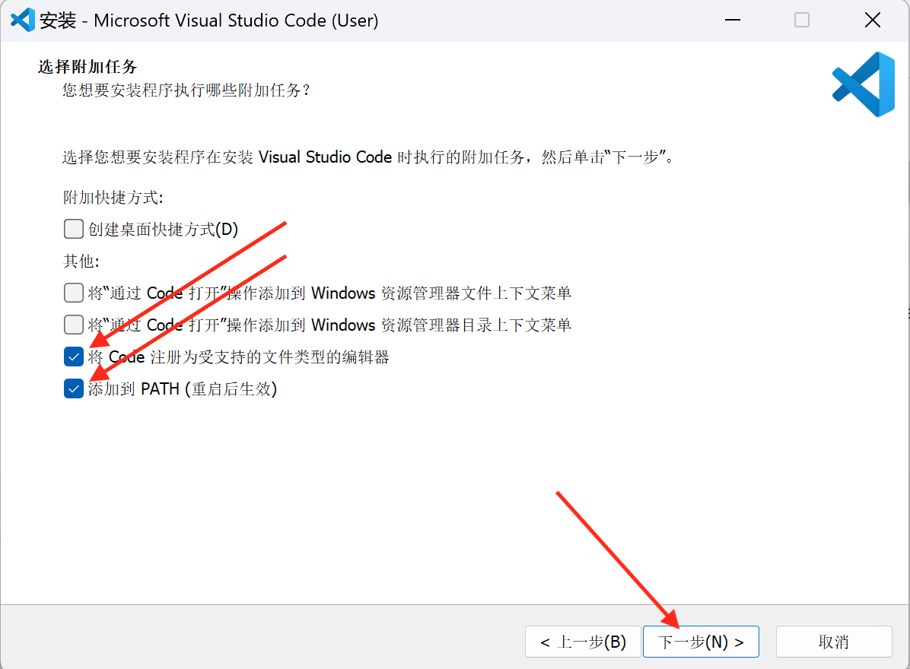
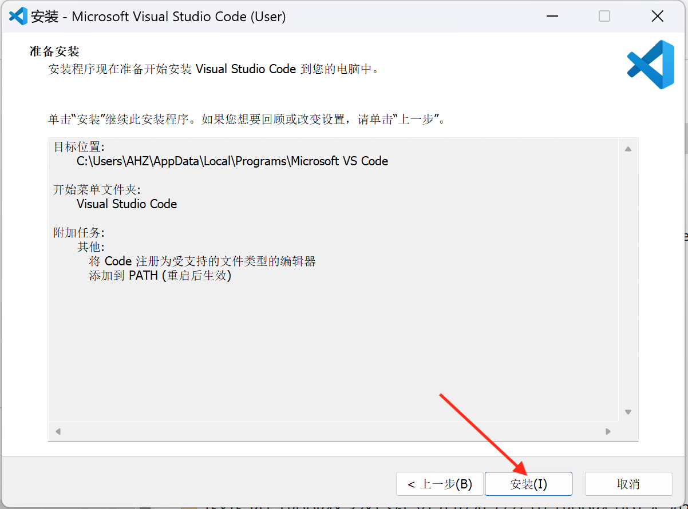
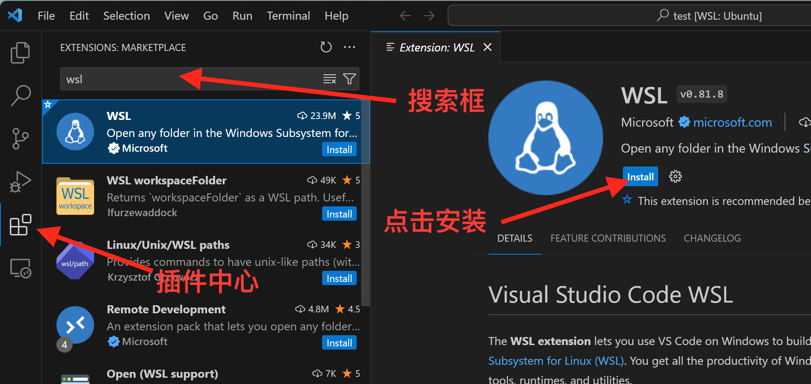
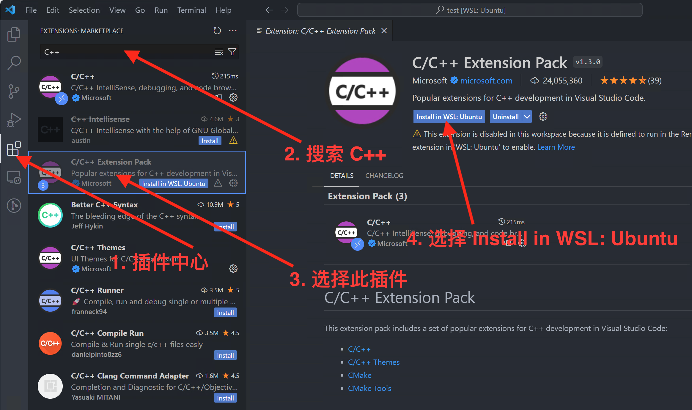
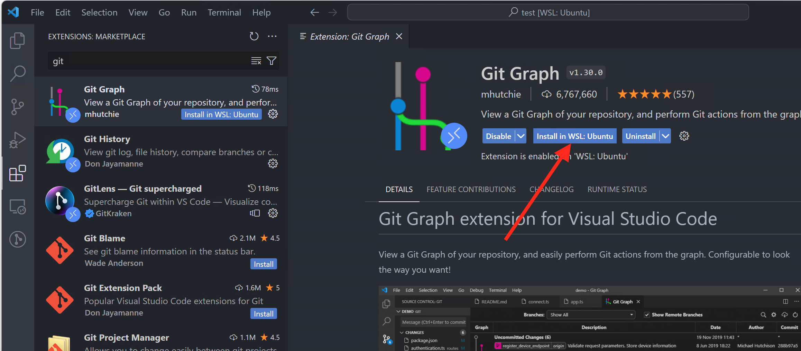

# VS Code CMake C++环境搭建

!!! success "请仔细阅读本文后再进行实操"

## VS Code是什么？

VS Code 是由微软推出的一款轻量级但功能强大的源代码编辑器，支持 Windows、macOS 和 Linux 操作系统。它内置了对 JavaScript、TypeScript 和 Node.js 的支持，并拥有丰富的其他语言和运行时扩展生态系统（例如 C++、C#、Java、Python、PHP、Go、.NET）。VS Code近些年来越来越受开发者欢迎，是因为它的身上存在这么几个亮点：

1. 第一是**打开速度快**，用VS Code来打开一个项目，基本上可以说是秒开，即使是很大的项目，也可以非常快的被打开。

2. 第二是**支持的编程语言非常多**，VS Code在初始状态（即不按装任何的扩展的情况）下对Web前端开发、Node.js开发等语言的开发都有很好的支持，至于其它的一些编程语言，比如说：Java、Python、Go、Ruby、C#、C/C++等等，只要安装相应的扩展就能很好的完成开发环境的搭建。

3. 第三是**拥有丰富的扩展**，VS Code的扩展十分丰富，首先从量上来看，VS Code的扩展数量已经上万，涵盖了方方面面，你能想到的它都有。

接下来，我们来看两个可能会遇到的并且有点令人迷惑的英文词汇：``Visual Studio Code``和``Visual Studio``。其实``VS Code``的全称叫做 ``Visual Studio Code``，作为微软于2015年推出的一款代码编辑器，他还有一位老大哥，叫做``Visual Studio``。所以，``Visual Studio Code``和``Visual Studio``是两款不同的代码编辑器。

## Windows 安装 VS Code并连接到 WSL 环境中

通过前面的教程，你应该在你电脑安装好了 WSL 环境，接下来就需要你搭建一个用于开发 C++ 程序的 VS Code 开发环境。

### 步骤 1 - 下载 VS Code

VS Code 的下载地址：[Download VS Code](https://code.visualstudio.com/download)

### 步骤 2 - 安装 VS Code

双击点开下载好的 VS Code 安装包









!!! note "请注意"
    **请一定要勾选 “添加到PATH(重启后生效)”**





### 步骤 3 - 重启电脑

根据 VS Code 安装界面可知，环境变量需要重启计算机后才生效，因此此步骤需要对你的计算机进行重启。

### 步骤 4 - 安装 WSL 插件

打开 VS Code, 在插件中心搜索 `WSL` , 搜索到 WSL 插件后点击“install”进行安装。



安装好 WSL 插件后，关闭 VS Code

### 步骤 5 - WSL 命令行中启动 VS Code

打开 VS Code 命令行，输入如下命令，第一次打开需要进行环境初始化，你需要等待一两分钟。
一旦初识化结束，第二次打开便会很快。

```bash
code .
```


### 步骤 6 - 安装 C++ 开发必备 VS Code插件

主要会用到如下几个插件

- C/C++ : 提供c++调试功能和一些智能提示
- CMake : 提供CMake支持
- CMake Tools : 拓展CMake功能
- Git Graph : Git 图形化显示和操作

此处我们选择 C/C++ Extension Pack 插件，这个插件包含了 C/C++, CMake, CMake Tools, C/C++ Themes四个插件。



!!! Tip "安装到WSL环境中"
    此处一定要选择 Install in WSL: Ubuntu，否则插件就安装到 Windows 宿主环境中，并不能在 WSL 环境中起作用。



到此我们在 WSL环境中 VS Code 开发C++所需的环境和插件已安装好，请阅读“配置一个工程项目”小节的内容。

## Ubuntu 安装 VS Code


## MacOS 安装 VS Code


## 配置一个工程项目

在开始这一部分的教程时，请先阅读 [CMake基础](./cmake.md) 的教程，了解基础的cmake知识，
同时阅读 [Linux文件和文件夹操作](./linux/file.md)的教程，接下来我们需要用到一些Linux的基础命令。


## VS Code Debug C++ 程序